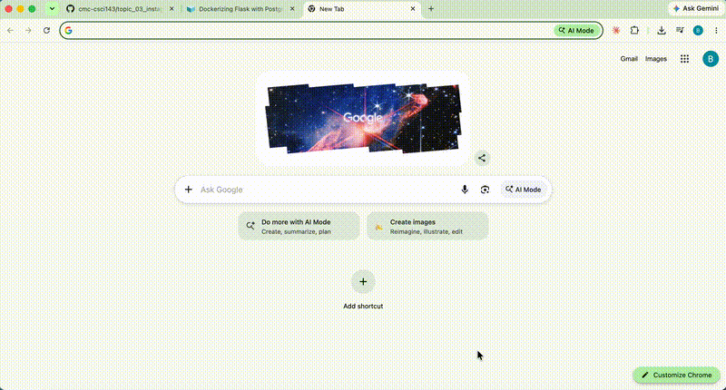

# Flask on Docker

[](https://github.com/Hehesh/flask-on-docker/actions/workflows/docker-build.yml)

## Overview

This project implements a containerized Flask web application using a stack modeled on the infrastructure behind large-scale web services such as Instagram. Docker Compose orchestrates Flask, Gunicorn, PostgreSQL, and Nginx. The application supports database persistence through SQLAlchemy, image and file uploads, and direct static and media file delivery through Nginx. Development and production-style configurations are separated, with the latter using a multi-stage Docker build, non-root application execution, and persistent Docker volumes.

### Architecture

```text
Client
  |
  v
Nginx (port 1131 on host)
  |
  +---- /static/ ----> Static volume
  |
  +---- /media/ -----> Media volume
  |
  +---- / -----------> Gunicorn
                        |
                        v
                       Flask
                        |
                        v
                     SQLAlchemy
                        |
                        v
                     PostgreSQL
```

### Demonstration



The demonstration shows the application running, uploading an image through the browser, and retrieving the uploaded image.

## Technologies

- Python 3.11 and Flask
- Gunicorn (WSGI application server)
- Nginx (reverse proxy and static/media server)
- PostgreSQL 13
- SQLAlchemy
- Docker and Docker Compose
- GitHub Actions (continuous integration)

## Build Instructions

### Prerequisites

Install Docker with the Docker Compose plugin. The following commands assume Docker is already running.

### Development

Clone the repository:

```bash
git clone https://github.com/Hehesh/flask-on-docker.git
cd flask-on-docker
```

Create the development environment configuration:

```bash
cp .env.dev.example .env.dev
```

Build and start the application:

```bash
docker compose up -d --build
```

Test the endpoint:

```bash
curl http://localhost:1131/
```

Expected output:

```json
{"hello":"world"}
```

The development application is available at `http://localhost:1131/`.

### Production-style deployment

Stop development first, because both configurations use host port 1131:

```bash
docker compose down
```

Create the production environment files:

```bash
cp .env.prod.example .env.prod
cp .env.prod.db.example .env.prod.db
```

These example credentials are intended for local testing only.

Build and run the production stack:

```bash
docker compose -p flask-prod -f docker-compose.prod.yml up -d --build
```

Initialize the database on first setup only:

```bash
docker compose -p flask-prod -f docker-compose.prod.yml exec web python manage.py create_db
```

**Warning:** The tutorial's `create_db` command drops existing tables. Do not rerun it against a database containing data you wish to retain.

Access the application at `http://localhost:1131/`.

### Upload and retrieve media files

Open `http://localhost:1131/upload` in a browser, choose an image, and click Upload.

Alternatively, upload a file from the command line:

```bash
curl -F "file=@example.png" http://localhost:1131/upload
```

Retrieve it:

```bash
curl http://localhost:1131/media/example.png --output downloaded.png
```

Static files are available under `/static/`, and uploaded media files are available under `/media/`.

### Stop the application

Development:

```bash
docker compose down
```

Production:

```bash
docker compose -p flask-prod -f docker-compose.prod.yml down
```

Named Docker volumes are retained by default, preserving database and media files between container restarts.

## Project Structure

```text
.
├── .github/workflows/docker-build.yml
├── docker-compose.yml
├── docker-compose.prod.yml
├── services/
│   ├── nginx/
│   │   ├── Dockerfile
│   │   └── nginx.conf
│   └── web/
│       ├── Dockerfile
│       ├── Dockerfile.prod
│       ├── entrypoint.sh
│       ├── manage.py
│       ├── requirements.txt
│       └── project/
│           ├── __init__.py
│           ├── config.py
│           ├── static/
│           └── media/
└── README.md
```

## Continuous Integration

GitHub Actions automatically builds the development Docker image, starts the Flask and PostgreSQL services, and verifies that the application responds with the expected JSON output. The workflow runs on pushes and pull requests.

## Implementation Notes

- Development uses a source-code bind mount for rapid iteration.
- Production-style deployment uses a multi-stage Docker build and a non-root application user.
- Nginx forwards dynamic requests to Gunicorn and serves static and uploaded files directly.
- PostgreSQL and uploaded media are stored in persistent named volumes.
- Credential files are excluded from version control; example configurations are supplied for reproducibility.

This project is an educational implementation, not a hardened public deployment. The upload endpoint requires additional authentication, file validation, and access controls before public deployment.

## Reference

Based on the [TestDriven.io Flask, PostgreSQL, Gunicorn, and Nginx Docker tutorial](https://testdriven.io/blog/dockerizing-flask-with-postgres-gunicorn-and-nginx/), adapted for the CSCI 143 Big Data course.
